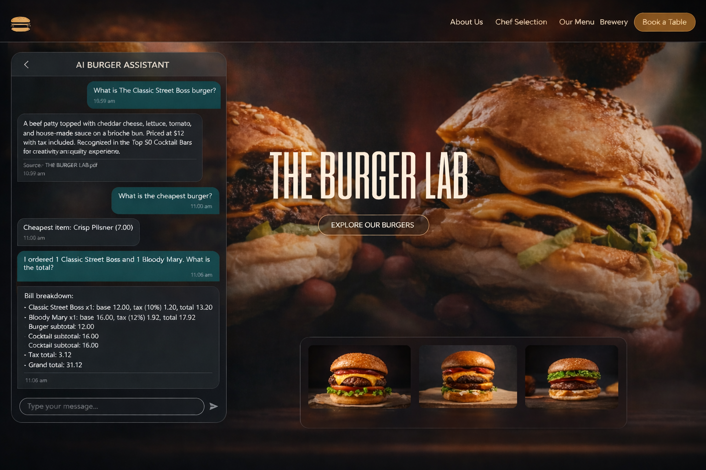

# AI Burger Assistant (RAG Chatbot)

A modern full-stack, local-first RAG chatbot that answers questions from Burger Lab menu PDFs and supports smart menu operations like recommendations, billing, and item lookup.

Built for fast local experimentation with **FastAPI + FAISS + SentenceTransformers + Ollama (phi3)** on the backend and a **React + Vite + TailwindCSS** chat UI on the frontend.

---

## Features

- Chat with Burger Lab PDF knowledge base using Retrieval-Augmented Generation (RAG)
- Smart food recommendations based on ingredient-style prompts (e.g., beef, tomato)
- Rule-based billing with per-item tax calculation
- Cheapest item detection
- Menu availability detection with RAG fallback
- Multi-PDF vector search support
- ChatGPT-style frontend experience
- Fully local runtime using Ollama

---

## Tech Stack

**Backend**
- Python
- FastAPI
- FAISS
- SentenceTransformers (`all-MiniLM-L6-v2`)
- Ollama (`phi3:latest`)

**Frontend**
- React
- Vite
- TailwindCSS

---

## Screenshots

<p align="center">
  
</p>

---

## Installation

### 1) Clone the repository

```bash
git clone https://github.com/<your-username>/<your-repo>.git
cd <your-repo>
```

### 2) Backend setup (FastAPI + RAG)

```powershell
cd backend
python -m venv .venv
.venv\Scripts\activate
pip install -r requirements.txt
```

### 3) Frontend setup (React + Vite + Tailwind)

Open a new terminal:

```powershell
cd frontend
npm install
```

---

## Run Ollama (Local LLM)

Make sure Ollama is installed and running.

1. Start Ollama service (if not already running)
2. Pull model:

```powershell
ollama pull phi3:latest
```

3. (Optional) test model:

```powershell
ollama run phi3:latest
```

Backend expects Ollama at:
- `http://localhost:11434`

---

## Run the Project

### Terminal 1: Backend API

```powershell
cd backend
.venv\Scripts\activate
uvicorn main:app --reload --host 0.0.0.0 --port 8000
```

### Terminal 2: Frontend

```powershell
cd frontend
npm run dev
```

Open the frontend URL shown by Vite (usually `http://localhost:5173`).

---

## Example Questions to Try

- "What burgers contain beef and tomato?"
- "Suggest a burger if I like truffle flavor."
- "What is the cheapest item?"
- "Calculate total bill for 2 Classic Street Boss and 1 Bloody Mary."
- "Do you have chicken options?"
- "What drinks are available?"
- "Summarize the Burger Lab menu highlights."

---

## Folder Structure

```text
rag/
├─ backend/
│  ├─ main.py
│  ├─ requirements.txt
│  └─ .venv/                      # local virtual environment (not committed)
├─ frontend/
│  ├─ package.json
│  ├─ vite.config.js
│  ├─ tailwind.config.js
│  ├─ postcss.config.js
│  └─ src/
│     ├─ App.jsx
│     ├─ main.jsx
│     ├─ index.css
│     └─ components/
├─ pdfs/                           # Burger Lab menu PDFs
├─ pdf-vector.py                   # builds vector DB from PDFs
├─ question-vector.py              # RAG + menu logic (billing/recommendations)
├─ vectors.index                   # FAISS index (generated)
└─ chunks.pkl                      # chunk metadata (generated)
```

---

## Future Improvements

- Add authentication and per-user chat history
- Stream token-by-token responses from backend to frontend
- Add admin panel for menu updates without code changes
- Add evaluation pipeline for RAG answer quality
- Dockerize backend + frontend for one-command startup
- Add multilingual support and voice input

---

## Author

**Your Name**  
AI Burger Assistant (RAG Chatbot)  
GitHub: [https://github.com/<your-username>](https://github.com/<your-username>)
